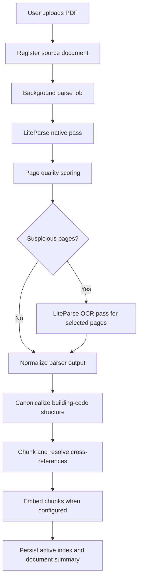

# LiteParse Auto-OCR Knowledge Base Parser Design

Date: 2026-06-20

## Summary

MEP Lab should replace Docling as the default knowledge-base extraction engine for building-code PDFs. The new default parser will use LiteParse as a fast, local, deterministic document parser, with auto-selective OCR enabled internally and no user-facing OCR toggle.

The target documents are primarily selectable-text PDFs. For that corpus, the pipeline should prefer native PDF text extraction, preserve page and bounding-box provenance, and reserve OCR for suspicious pages where native extraction appears incomplete or corrupt.

Docling should remain available as an optional future fallback path, but it should not block the default upload flow or require bundled Hugging Face model artifacts for ordinary selectable-text PDFs.

## Goals

- Parse large selectable-text code PDFs much faster than the current Docling pipeline.
- Avoid Docling's local model artifact failure mode and heavy CPU behavior for ordinary PDFs.
- Keep extraction local and offline by default.
- Preserve the existing downstream canonical model: pages, elements, tables, chunks, sections, cross-references, citations, diagnostics, and graph summaries.
- Enable OCR automatically only when page-level native extraction quality is suspicious.
- Keep OCR behavior internal and observable through diagnostics, not configurable through a visible Settings toggle.
- Make upload and reparse visibly asynchronous, with progress and resilient interruption behavior.

## Non-Goals

- Do not build a general-purpose document parser from scratch.
- Do not expose OCR mode selection in the user interface.
- Do not optimize for scanned/image-only documents as the primary case.
- Do not replace the MEP Lab building-code canonicalizer with LiteParse Markdown headings alone.
- Do not require cloud parsing, LlamaParse, or any external API for the default path.

## Decision

Use LiteParse as the leading candidate for the default extraction engine.

LiteParse is a standalone local parser built around a Rust core and PDFium text extraction. It provides Node.js, Python, Rust, WASM, and CLI surfaces; supports Markdown, JSON, and text output; includes bounding boxes; supports page selection; supports screenshot generation; and can use OCR through bundled Tesseract or an HTTP OCR server. It is licensed Apache 2.0.

For MEP Lab, the preferred integration path is the Node.js package, `@llamaindex/liteparse`, because the app is Electron/TypeScript and already has a Node-driven main process. Implementation should begin with a packaging spike for the Node package on Windows and macOS. If native binding packaging fails or proves fragile, the supported fallback is invoking the `lit` CLI from the bundled Node/runtime layer behind the same parser adapter interface.

## Parser Architecture

Introduce a parser adapter boundary so the knowledge-base service no longer depends directly on a Docling-shaped parser.

The adapter will expose a normalized result equivalent to the current `NormalizedDoclingResult`, but with parser-neutral naming:

- parser name and version
- document-level diagnostics
- pages with page number, text, extraction mode, and optional bounding data
- elements with kind, text, page number, bounding box, confidence, and source ids
- tables with page number, caption, columns, rows, notes, confidence, and source ids
- per-page extraction diagnostics

The existing canonicalization layer will consume this normalized result. It will remain responsible for section detection, hierarchy building, table attachment, chunking, cross-reference resolution, and citation construction.

## Auto-OCR Flow

The parser always runs in internal auto-OCR mode.

1. Run a native LiteParse pass over the PDF.
2. Score each page using cheap extraction-quality signals.
3. Identify suspicious pages.
4. Reparse only suspicious pages with OCR enabled.
5. Merge OCR page output into the normalized document.
6. Record page provenance as `native`, `ocr`, or `native_plus_ocr`.
7. Continue indexing even if OCR fails for some pages, with warnings.

The user sees no OCR toggle. They may see diagnostics such as:

`Parsed 1,642 pages. OCR used on 7 pages.`

## Suspicious Page Detection

A page is suspicious when native extraction suggests the text layer is missing, incomplete, or corrupt.

Initial signals:

- Very low extracted character count for a non-blank page.
- Very low word count.
- High ratio of replacement characters or unreadable glyphs.
- Large image regions with little or no text.
- Native extracted text has obvious corruption such as repeated null-like characters, replacement glyphs, or extreme single-character spacing.
- Page has table-like ruling geometry but little extracted cell text.
- Page is near an expected code-document region but lacks normal code patterns.

Expected code-document patterns should be treated as soft signals, not hard requirements. Examples include section identifiers, article numbering, table numbers, appendix headings, and clause references.

The first implementation can use conservative thresholds and emit diagnostics with page numbers and reasons. Thresholds should live in code as named constants so they can be tuned after sample-document benchmarks.

## OCR Guardrails

OCR must never become an unbounded full-document CPU sink in normal operation.

Guardrails:

- OCR only suspicious pages.
- Cap OCR workers internally.
- Prefer a default worker count that leaves the app usable, such as `max(1, logicalCores - 2)`, subject to platform testing.
- Set a per-document OCR page budget or warning threshold for the first version.
- If OCR dependencies or language data are missing, continue with native extraction and record a warning.
- If OCR fails on one page, continue other pages and preserve native text for that page.

## Upload And Reparse UX

Upload should no longer feel frozen.

The knowledge-base service should separate registration from parsing work:

- Copy source file and create a document record immediately.
- Start parsing as a background job.
- Persist progress, current phase, page counts, OCR page counts, and diagnostics.
- Let the Settings panel refresh or subscribe to progress updates.
- Mark in-progress jobs as `interrupted` on startup if the app closed before completion, with reparse as the recovery action.
- Reparse should enqueue a new parse job and show progress on the document row.

User-facing states should include:

- queued
- parsing
- ocr
- canonicalizing
- embedding
- ready
- ready with warnings
- failed
- interrupted

The UI should keep controls responsive and show a spinner/progress message during long work.

## Data Flow

## Error Handling

Parser failures should be actionable and phase-specific.

Examples:

- Native parse failed: record parse error and leave existing active index untouched.
- OCR failed on selected pages: record page-level warning and proceed with native output.
- Canonicalization found no building-code sections: fail that document and preserve the prior active index.
- Embedding failed: mark ready with warnings and keep exact lookup available.
- App closed mid-parse: preserve enough job state to mark the document `interrupted` on next startup and show reparse as the recovery action.

The current behavior of preserving the prior active index on parse/canonicalization failure should remain.

## Testing Strategy

Add focused tests at three levels.

Parser adapter tests:

- Normalizes LiteParse JSON into the parser-neutral contract.
- Preserves page numbers, text, bounding boxes, and parser version.
- Records `native`, `ocr`, and `native_plus_ocr` page provenance.
- Merges OCR output only for selected suspicious pages.
- Continues when OCR fails for one page.

Page quality tests:

- Does not OCR normal selectable-text code pages.
- Flags blank-looking image pages.
- Flags garbled text.
- Flags low-text pages with image-heavy content.
- Treats code-pattern absence as a soft signal.

Knowledge-base service tests:

- Upload registers immediately and parse proceeds as a job.
- Progress states are persisted.
- Failed parse preserves prior active index.
- Reparse shows parsing status and preserves existing index on failure.
- Diagnostics include OCR page counts.

## Rollout Plan

1. Add the parser-neutral adapter interface beside the existing Docling parser.
2. Implement the LiteParse adapter and normalization.
3. Add page-quality scoring and selective OCR merge.
4. Switch the knowledge-base service to depend on the parser-neutral contract.
5. Keep Docling code behind an adapter for fallback or removal after validation.
6. Convert upload/reparse into background jobs with progress.
7. Run benchmarks on representative selectable-text building-code PDFs.
8. Make LiteParse the default parser when benchmarks show acceptable section/table/reference quality.

## Acceptance Criteria

- Uploading a large selectable-text PDF creates a document row immediately and does not block the Settings UI.
- The parser extracts native text first and OCRs only pages classified as suspicious.
- The default UI exposes no OCR toggle or parser-mode selector.
- Document diagnostics report total pages parsed and OCR page count.
- OCR worker count is capped internally.
- If OCR fails on a page, native extraction output is preserved and indexing continues with a warning.
- If parsing or canonicalization fails, the prior active index remains usable.
- Reparse uses the same background job and progress model as upload.
- App restart during parsing marks the document `interrupted` and allows reparse.
- Tests cover parser normalization, page-quality scoring, selective OCR merge, index preservation, and progress-state persistence.

## Validation Items

- Verify whether the LiteParse Node package packages cleanly under Electron on Windows and macOS. Use the CLI fallback if not.
- Benchmark LiteParse table output against representative building-code tables. Add a supplemental table pass only if current table retrieval quality regresses.
- Tune page-quality thresholds with representative large code PDFs before enabling LiteParse as the default.

## References

- LiteParse repository: https://github.com/run-llama/liteparse
- LiteParse documentation: https://developers.llamaindex.ai/liteparse/
